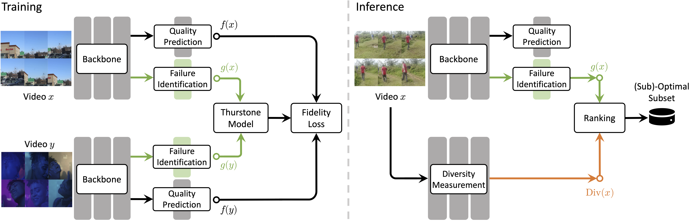

<p align="center">
    
</p>

<div align="center">

# Model-Informed Data Selection for Video Quality Assessment

This is the official code of MDS-VQA.

<a href="https://arxiv.org/pdf/2603.11525" target="_blank">
    
</a>

<br>

<p align="center">
    
</p>

</div>

<br>

> *We augment the base VQA model f(·) with a failure predictor g(·) that estimates how likely a video is to expose the model’s errors. In this repo, f(·) is instantiated by VisualQuality-R1 and g(·) is parameterized by LoRA adapters attached to the frozen base VQA model during failure-predictor training. You can instantiate f(·) by your **own VQA model**.*

## Installation
The experiments reported in the paper were conducted on 8 NVIDIA A6000 GPUs with 48GB memory each. To set up the training environment, use the following commands:
```
conda create -n mds_vqa python=3.11.10
conda activate mds_vqa

bash setup.sh
```

## Preparation

Here, we treat [YouTube-UGC](https://media.withyoutube.com/) as a labeled dataset and use it to train a base VQA model. We treat the [YouTube-SFV SDR](https://media.withyoutube.com/sfv-hdr) dataset as an unlabeled dataset collected from real-world scenarios, and select samples from it that expose the weaknesses of the base VQA model to perform active fine-tuning and enhance the base VQA model. MOS annotations of [YouTube-SFV SDR](https://media.withyoutube.com/sfv-hdr) are used only for evaluation or after selected samples are labeled.

1. To smoothly execute the training procedure, first download VQA datasets (we provide YouTube-SFV SDR as the example) and place all videos in a **single folder** (*i.e.* `DATA_ROOT`).

2. Given an original MOS file (*e.g.*, `datasets/ugc/ugc_mos.txt` and `datasets/sdr/sdr_mos.txt`), first execute `cd datasets`, then run `python make_data.py` (with moderate modifications) to generate a JSON file in VQR1 format (*e.g.* `datasets/RL-VQA_finetune_ugc.jsonl`).

3. Train a base VQA model with the labeled dataset (*i.e.* YouTube-UGC) or download it from [hollow404/VQR1-7B-YouTubeUGC](https://huggingface.co/hollow404/VQR1-7B-YouTubeUGC) and put it into `ckpt/VQR1-7B-YouTubeUGC`.

4. Generate the prediction scores on the labeled dataset with the base VQA model (*e.g.* `datasets/ugc.json`).

5. Run `python datasets/make_data_difficult.py` (with moderate modifications) to generate a JSON file (*e.g.* `datasets/RL-VQA_training_failure_prediction.jsonl`) for training failure prediction module (*i.e.* LoRA).

## Training

Modify `DATA_ROOT`, `DATA_FILE_PATHS` and `MODEL_NAME_OR_PATH` in `src/open-r1-multimodal/run_scripts/single_node_training_failure_prediction.sh` if your paths are different from the default paths. Then, run:
```bash
bash src/open-r1-multimodal/run_scripts/single_node_training_failure_prediction.sh
```
If multiple nodes training is needed, please refer to [VisualQuality-R1](https://github.com/TianheWu/VisualQuality-R1).

## Inference

After training the failure predictor, run inference on the target unlabeled pool to obtain failure scores. Modify the configuration block for model path, data root, labels path, input JSON and output path in `src/inference.py`:
```bash
python src/inference.py --ckpt-path /path/to/ckpt --video-roots /path/to/videos --filter-paths /path/to/filter --save-paths /path/to/save
```
We provide an example in `test_results/training_failure_prediction/sdr_130.json`. The corresponding checkpoint of YouTube-SDR is also available on [huggingface](https://huggingface.co/hollow404/MDS-VQA-Failure-Predictor).

## Greedy Selection with Diversity

Please run:
```bash
python src/greedy_selection.py \
--video-dir /path/to/your/DATA_ROOT \
--failure-score-path /path/to/your/failure_score/path \
--baseline-pred-path /path/to/your/base-model_pred_quality_score/path \
--diversity-feature-path /path/to/your/diversity_features/path \
--model-name CLIP_RN101
```
You can select [CLIP](https://github.com/openai/CLIP) or [SigLIP 2](https://github.com/google-research/big_vision) as the encoder to generate diversity features. We also provide the CLIP features in [huggingface](https://huggingface.co/datasets/hollow404/MDS-VQA_sdr_diversity_features). You can download it and set `--diversity-feature-path` to the download path. If using [SigLIP 2](https://github.com/google-research/big_vision), regenerate features and set `--model-name` accordingly.
> *Note: If you select SigLIP 2, please use another python environment with `transformers>=4.50.0.dev0`, or you may meet `size mismatch` error.*

## Active Fine-tuning

Merge the labeled dataset and your selected data, then generate the JSON file (*e.g.* `datasets/RL-VQA_finetune_ugc_selected_sdr.jsonl`). Then modify `DATA_ROOT`, `DATA_FILE_PATHS` and `MODEL_NAME_OR_PATH` in `src/open-r1-multimodal/run_scripts/single_node_finetuning.sh` if your paths are different from the default paths, and run:
```bash
bash src/open-r1-multimodal/run_scripts/single_node_finetuning.sh
```
Finally, please run the inference:
```bash
python src/inference.py --ckpt-path /path/to/ckpt --video-roots /path/to/videos --filter-paths /path/to/filter --save-paths /path/to/save --quality-assessment
```
under the guidance of [VisualQuality-R1](https://github.com/TianheWu/VisualQuality-R1). We follows the VisualQuality-R1-style scoring prompt:
```text
You are doing the video quality assessment task. 
Here is the question: What is your overall rating on the quality of this video? The rating should be a float between 1 and 5, rounded to two decimal places, with 1 representing very poor quality and 5 representing excellent quality.
First output the thinking process in <think> </think> tags and then output the final answer with only one score in <answer> </answer> tags.
```
The checkpoint is available on [huggingface](https://huggingface.co/hollow404/MDS-VQA-Active-Finetuning).

## Acknowledgement
MDS-VQA is based on [VLM-R1](https://github.com/om-ai-lab/VLM-R1) and [VisualQuality-R1](https://github.com/TianheWu/VisualQuality-R1). This repository is also inspired by the following outstanding contributions to the open-source community: [SigLIP 2](https://github.com/google-research/big_vision), [UVQ](https://github.com/google/uvq) and [CLIP](https://github.com/openai/CLIP).


## Contact
If you have any question, please email `jian.zou@my.cityu.edu.hk`.


## Citation
If you find MDS-VQA is helpful to your research, please consider citing our work:
```
@article{zou2026mds,
  title={MDS-VQA: Model-Informed Data Selection for Video Quality Assessment},
  author={Zou, Jian and Xu, Xiaoyu and Wang, Zhihua and Wang, Yilin and Adsumilli, Balu and Ma, Kede},
  journal={arXiv preprint arXiv:2603.11525},
  year={2026}
}
```
